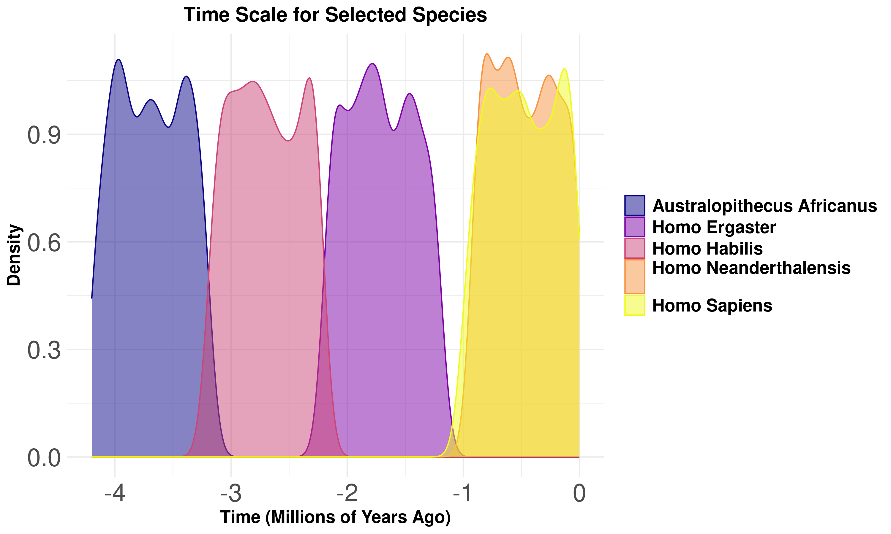
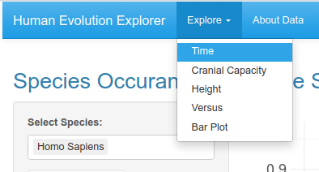

# Evolution Explorer: a tool to explore evolution of hominids

## About

Using the explorer, you can generate different plots using data of hominid evolution and later download them.

### Example plot generated using the Explorer

## How to use it

You can run the explorer using Rstudio.

After opening it you have 5 options of exploration.

### Time, Cranial Capacity, Height

Each of these modes allows the user to select for species that will be used for the plot.

"Time" plots the density of records over the time.

"Height" plots height as a function of time.

"Cranial Capacity" plots cranial capacity as a function of time.

### Versus

In this mode, user can select two numeric variables and one as a function of another.

Additionally a "grouping variable" can be chosen to color the data points by the chosen variable.

### Bar Plot

Here, user can select a category for which a bar plot is created.

Again, a grouping variable can be selected, it results in a stack bar plot, where each stack is assigned to a group.

## Data

Data comes from: [SantiagoCostabile](https://www.kaggle.com/datasets/santiago123678/biological-data-of-human-ancestors-data-sets/data?select=Evolution_DataSets.csv)
