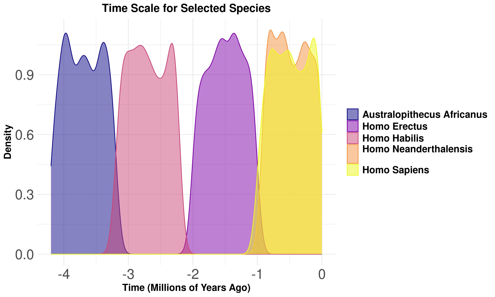

# Evolution Explorer: a tool to explore evolution of hominids

## About

Using the explorer, you can generate different plots using data of hominid evolution and later download them.

### Example plot generated using the Explorer

## How to run it

## Data

Data comes from: [SantiagoCostabile](https://www.kaggle.com/datasets/santiago123678/biological-data-of-human-ancestors-data-sets/data?select=Evolution_DataSets.csv)
